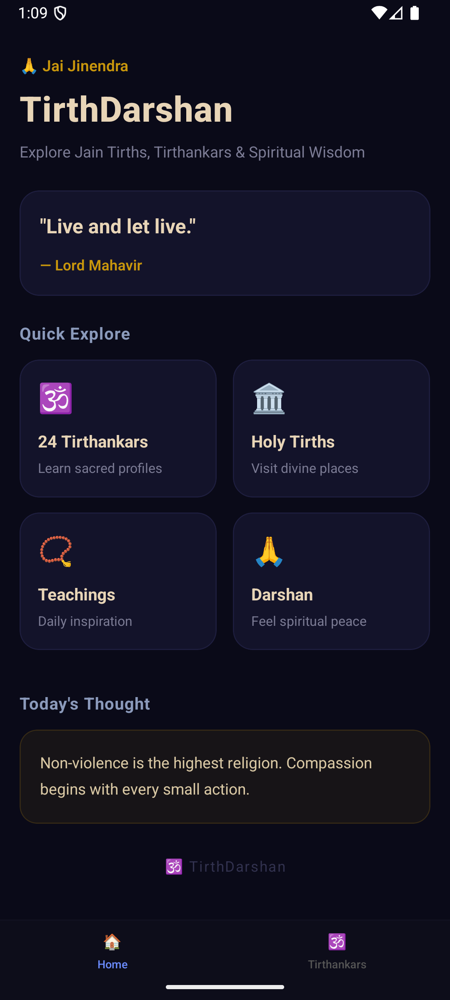
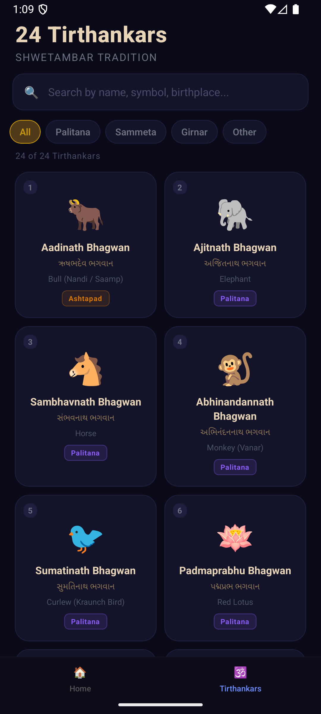

# 🕉️ TirthDarshan

A beautiful and modern **React Native spiritual mobile application** built to explore Jain heritage, sacred Tirths, Tirthankars, teachings, and divine places.

Designed with a premium dark UI, smooth navigation, reusable components, and a peaceful user experience.

---

## 📱 Features

### ✨ Home Screen
- Premium spiritual UI design
- Welcome message with Jain greeting
- Inspirational quote card
- Quick explore action cards
- Daily thought section

### 🕉️ Tirthankars
- Explore all 24 Jain Tirthankars
- Detailed profiles
- Sacred symbols, colors, teachings, life events
- Panch Kalyanak details
- Share profile feature

### 🏛️ Tirth Places
- Discover famous Jain pilgrimage places
- Sacred history and significance
- Darshan experience
- Temple details and navigation

### 📖 Teachings
Learn spiritual values such as:

- Ahimsa (Non-violence)
- Satya (Truth)
- Aparigraha (Non-attachment)
- Compassion
- Self-discipline
- Spiritual growth

### 🎨 UI / UX
- Dark premium theme
- Reusable ScreenWrapper with Safe Area
- Smooth navigation
- Bottom tabs
- Custom headers
- Clean modern design
- Responsive layout

---

## 🚀 Tech Stack

- React Native
- TypeScript
- React Navigation
- Native Stack Navigator
- Bottom Tabs Navigator
- react-native-safe-area-context

---

## 📂 Project Structure

```bash
Tirth-Darshan/
│── src/
│   ├── components/
│   │   └── ScreenWrapper.tsx
│   │
│   ├── navigation/
│   │   └── index.tsx
│   │
│   ├── screens/
│   │   ├── HomeScreen.tsx
│   │   ├── TirthankarListScreen.tsx
│   │   ├── TirthankarProfileScreen.tsx
│   │   └── TirthDetailScreen.tsx
│   │
│   ├── data/
│   │   ├── tirthankars.ts
│   │   └── tirths.ts
│   │
│   └── assets/
│
│── App.tsx
│── package.json
│── README.md

---

## ⚙️ Installation

Clone the repository:

```bash
git clone https://github.com/Apurv3027/Tirth-Darshan.git
```

Go to project folder:

```bash
cd Tirth-Darshan
```

Install dependencies:

```bash
npm install
```

---

## ▶️ Run App

### Android

```bash
npx react-native run-android
```

### iOS

```bash
cd ios
pod install
cd ..
npx react-native run-ios
```

---

## 🔥 Current Modules

* Home Dashboard
* 24 Tirthankars Listing
* Tirthankar Detailed Profile
* Famous Tirth Places
* Teachings Section
* Safe Area Support
* Bottom Navigation

<!-- ---

## 🌟 Future Roadmap

* Temple Locator with Maps
* Daily Notifications
* Jain Calendar
* Audio Bhakti / Stavans
* Multi-language Support
* User Favorites
* Search Functionality
* Reels / Shorts
* Offline Mode
* Donation Module -->

---

## 📸 Screenshots

*Add app screenshots here*

```md



```

---

## 🙏 Purpose

TirthDarshan is created to preserve Jain culture and spirituality digitally, helping users connect with sacred teachings and pilgrimage places in a modern mobile experience.

---

## 🤝 Contributing

Contributions, suggestions, and feature requests are welcome.

1. Fork the repository
2. Create your feature branch
3. Commit your changes
4. Push your branch
5. Open a Pull Request

---

## 📄 License

This project is licensed under the MIT License.

---

## 👨‍💻 Developer

Developed with devotion using React Native.

**Apurv Patel**

---

## 🕉️ Jai Jinendra

May peace, wisdom, and compassion guide all beings.
